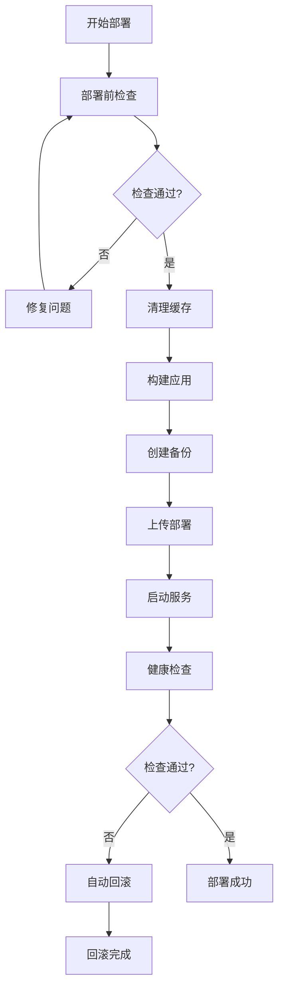

# 🚀 InterviewPro 改进部署指南

## 📋 概述

本指南介绍了InterviewPro项目的改进部署流程，包含统一的部署脚本、缓存清理、预检查和回滚机制，确保本地代码和AWS服务器代码的一致性。

**改进目标**：
- ✅ 解决本地和服务器代码不一致问题
- ✅ 实现原子化部署和自动回滚
- ✅ 增强部署前检查和验证
- ✅ 统一部署流程和操作

## 📁 新增脚本文件

| 脚本文件 | 功能 | 用途 |
|---------|------|------|
| `deploy-unified.sh` | 统一部署脚本 | 替代所有分散的部署脚本 |
| `clean-cache.sh` | 缓存清理脚本 | 清理本地和服务器缓存 |
| `pre-deploy-check.sh` | 部署前检查脚本 | 验证环境和代码状态 |
| `rollback.sh` | 回滚脚本 | 紧急回滚到之前版本 |
| `DEPLOYMENT_GUIDE.md` | 部署指南 | 详细操作文档 |

## 🎯 部署流程概览



## 🔧 脚本使用说明

### 1. 统一部署脚本 (`deploy-unified.sh`)

**功能**：完整的端到端部署流程

**使用方法**：
```bash
# 基本部署
./deploy-unified.sh

# 为脚本添加执行权限（首次使用）
chmod +x deploy-unified.sh
```

**部署流程**：
1. **前提条件检查** - 验证环境和工具
2. **Git状态检查** - 确保代码同步
3. **SSH连接测试** - 验证服务器连接
4. **缓存清理** - 清理本地Docker和NPM缓存
5. **前端构建** - 构建生产版本
6. **后端打包** - 创建部署包
7. **服务器备份** - 自动备份当前版本
8. **文件上传** - 上传新版本到服务器
9. **服务部署** - 部署和启动新版本
10. **健康检查** - 验证服务正常运行
11. **回滚机制** - 失败时自动回滚

**特性**：
- ✅ 自动备份当前版本
- ✅ 失败时自动回滚
- ✅ 全程日志记录
- ✅ 健康检查验证
- ✅ 原子化操作

### 2. 缓存清理脚本 (`clean-cache.sh`)

**功能**：清理本地和服务器的各种缓存

**使用方法**：
```bash
# 交互式清理（推荐）
./clean-cache.sh

# 选项：
# 1) 仅清理本地缓存
# 2) 仅清理服务器缓存  
# 3) 清理本地和服务器缓存（推荐）
# 4) 退出
```

**清理内容**：

**本地清理**：
- 前端：`dist`、`node_modules/.cache`、`npm cache`、`.vite`
- 后端：`__pycache__`、`*.pyc`、`logs`、`uploads`
- Docker：镜像、容器、网络、卷、构建缓存
- Git：临时文件、远程分支
- 部署包：`*.tar.gz`

**服务器清理**：
- Docker：所有镜像、容器、构建缓存
- 临时文件：部署包、备份文件
- 系统：APT缓存、日志文件（保留7天）

### 3. 部署前检查脚本 (`pre-deploy-check.sh`)

**功能**：全面检查部署前环境和状态

**使用方法**：
```bash
# 执行全面检查
./pre-deploy-check.sh
```

**检查项目**：

**本地环境**：
- ✅ 工具安装：Git、Docker、NPM、Node.js
- ✅ 项目结构：frontend/、backend/目录
- ✅ 关键文件：package.json、docker-compose.prod.yml、SSH密钥

**Git状态**：
- ✅ Git仓库验证
- ✅ 当前分支检查
- ✅ 未提交更改检查
- ✅ 远程同步状态
- ✅ 最近提交活跃度

**项目检查**：
- ✅ 前端：package.json、依赖、构建脚本、TypeScript配置
- ✅ 后端：requirements.txt、Dockerfile、主应用文件、虚拟环境
- ✅ Docker：配置文件、服务状态
- ✅ 环境：配置文件、必要变量

**服务器检查**：
- ✅ SSH连接和权限
- ✅ 服务器状态（OS、内存、磁盘）
- ✅ 项目目录和Docker状态
- ✅ Git状态（如果存在）

**输出报告**：
```
======================================
         部署前检查报告
======================================
检查时间: 2024-01-07 15:30:00
检查项目: InterviewPro

检查统计:
  总检查项: 25
  通过: 22
  失败: 1
  警告: 2

通过率: 88%

✅ 建议: 存在警告项，建议修复后部署
======================================
```

### 4. 回滚脚本 (`rollback.sh`)

**功能**：紧急回滚到之前的版本

**使用方法**：

```bash
# 查看可用备份
./rollback.sh --list

# 回滚到最近备份
./rollback.sh --rollback

# 回滚到指定备份
./rollback.sh --rollback deploy_20240107_143000

# 查看当前状态
./rollback.sh --current

# 清理旧备份
./rollback.sh --cleanup
```

**功能特性**：
- ✅ 列出所有可用备份
- ✅ 快速回滚到最近版本
- ✅ 指定版本回滚
- ✅ 回滚前确认
- ✅ 创建紧急备份
- ✅ 回滚后健康检查
- ✅ 自动清理旧备份

## 📖 标准部署流程

### 完整部署流程

```bash
# 1. 部署前检查
./pre-deploy-check.sh

# 2. 清理缓存（可选，推荐）
./clean-cache.sh

# 3. 执行部署
./deploy-unified.sh

# 4. 验证部署结果
curl https://3.14.247.189/api/v1/health
```

### 紧急回滚流程

```bash
# 1. 查看当前状态
./rollback.sh --current

# 2. 列出可用备份
./rollback.sh --list

# 3. 执行回滚
./rollback.sh --rollback [backup_id]
```

## ⚠️ 注意事项和最佳实践

### 部署前准备

1. **确保代码同步**：
   ```bash
   git status
   git pull origin main
   ```

2. **检查SSH连接**：
   ```bash
   ssh -i aws-myy-rsa.pem ubuntu@3.14.247.189 "echo 'connection test'"
   ```

3. **验证环境配置**：
   - 检查 `.env.production` 文件
   - 确认 `docker-compose.prod.yml` 配置正确

### 部署时机选择

**建议的部署时机**：
- 🟢 **低峰期**：用户访问量较少的时间
- 🟢 **工作日**：便于监控和问题处理
- 🟢 **测试后**：完成充分的本地测试

**避免的部署时机**：
- 🔴 **高峰期**：用户活跃时间
- 🔴 **周末/节假日**：人员不足
- 🔴 **未测试**：代码未经验证

### 监控和验证

**部署后检查清单**：
```bash
# 1. 容器状态
ssh -i aws-myy-rsa.pem ubuntu@3.14.247.189 \
    "cd /home/ubuntu/InterviewPro && docker-compose -f docker-compose.prod.yml ps"

# 2. API健康检查
curl -s https://3.14.247.189/api/v1/health | jq

# 3. 前端访问测试
curl -I https://3.14.247.189

# 4. 日志检查
ssh -i aws-myy-rsa.pem ubuntu@3.14.247.189 \
    "cd /home/ubuntu/InterviewPro && docker-compose -f docker-compose.prod.yml logs --tail=20"
```

### 故障处理

**常见问题和解决方案**：

1. **部署失败**：
   - 自动回滚机制会启动
   - 检查日志查看具体错误
   - 修复问题后重新部署

2. **健康检查失败**：
   ```bash
   # 检查容器状态
   ./rollback.sh --current
   
   # 查看服务日志
   ssh -i aws-myy-rsa.pem ubuntu@3.14.247.189 \
       "cd /home/ubuntu/InterviewPro && docker-compose logs backend --tail=50"
   ```

3. **服务启动慢**：
   - 等待更长时间（Docker构建可能需要几分钟）
   - 检查服务器资源使用情况

4. **回滚失败**：
   ```bash
   # 手动回滚
   ssh -i aws-myy-rsa.pem ubuntu@3.14.247.189
   cd /home/ubuntu
   ls -la | grep InterviewPro-backup
   # 手动恢复最近的备份
   ```

## 🔐 安全注意事项

### SSH密钥管理

```bash
# 确保密钥权限正确
chmod 600 aws-myy-rsa.pem

# 定期检查密钥有效性
ssh -i aws-myy-rsa.pem ubuntu@3.14.247.189 "uptime"
```

### 环境变量保护

- 🔒 不要在脚本中硬编码敏感信息
- 🔒 使用独立的 `.env.production` 文件
- 🔒 确保敏感文件不被提交到Git

### 备份管理

- 💾 定期清理旧备份（自动清理保留5个）
- 💾 重要版本手动创建长期备份
- 💾 数据库备份独立管理

## 📊 性能优化建议

### 部署速度优化

1. **缓存策略**：
   - 使用 `npm ci` 而非 `npm install`
   - 利用Docker层缓存
   - 增量部署策略

2. **网络优化**：
   - 压缩传输文件
   - 并行上传多个文件
   - 使用就近的镜像源

3. **构建优化**：
   - 前端构建并行化
   - 后端依赖预安装
   - 避免重复构建

### 监控和告警

**建议的监控指标**：
- 🏥 服务健康状态
- 📈 响应时间
- 🔧 容器资源使用
- 📊 错误率统计

## 🆘 故障排除指南

### 问题诊断步骤

1. **检查脚本执行日志**
2. **验证SSH连接**
3. **检查服务器资源**
4. **查看应用日志**
5. **验证网络连接**

### 常用诊断命令

```bash
# 检查脚本执行权限
ls -la *.sh

# 测试网络连接
ping 3.14.247.189
curl -I https://3.14.247.189

# 检查本地Docker状态
docker info
docker-compose --version

# 查看服务器状态
./rollback.sh --current
./pre-deploy-check.sh
```

## 📚 附录

### 脚本退出码说明

| 退出码 | 含义 | 说明 |
|--------|------|------|
| 0 | 成功 | 操作完成无错误 |
| 1 | 失败 | 有严重错误，必须修复 |
| 2 | 警告 | 有警告项，建议修复 |

### 环境变量配置

**必要的环境变量**：
```bash
# .env.production
DATABASE_URL=sqlite:///instance/interview.db
JWT_SECRET_KEY=your-super-secret-jwt-key
CORS_ORIGINS=https://3.14.247.189,https://offerott.com
VITE_API_BASE_URL=https://3.14.247.189/api/v1
```

### 脚本配置说明

**可配置参数**（在脚本顶部）：
```bash
SERVER_IP="3.14.247.189"      # 服务器IP地址
KEY_FILE="aws-myy-rsa.pem"    # SSH密钥文件
REMOTE_USER="ubuntu"          # 服务器用户名
PROJECT_NAME="InterviewPro"   # 项目名称
```

---

## 📞 支持联系

如遇到问题，请按以下顺序排查：
1. 查看本指南的故障排除部分
2. 检查脚本执行日志
3. 查看服务器应用日志
4. 联系技术支持

**最后更新**：2024年1月7日  
**版本**：v1.0 