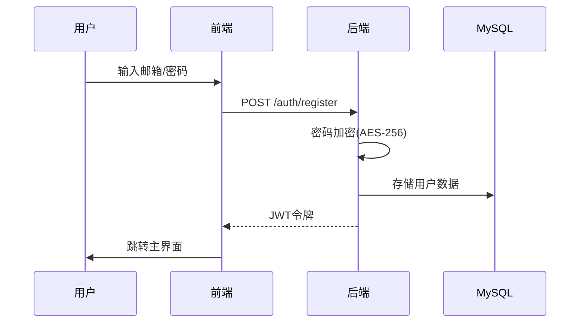
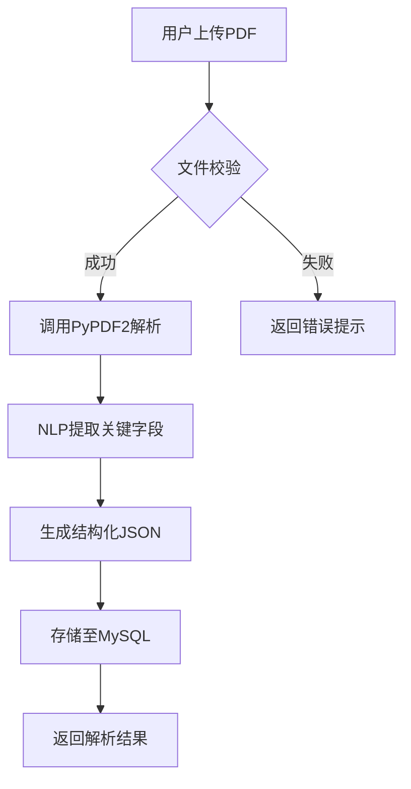
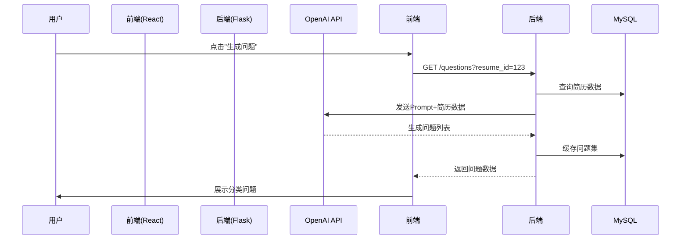
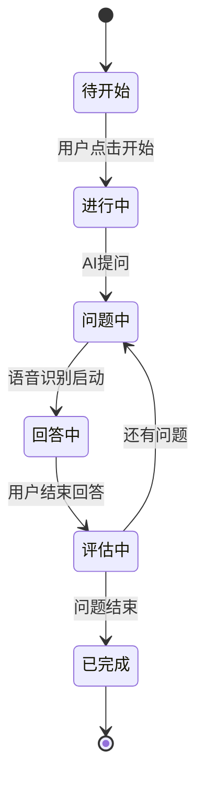
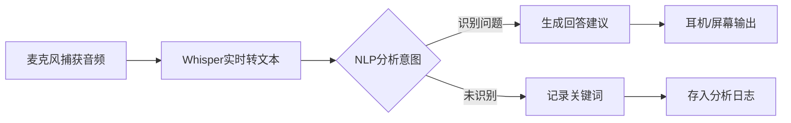
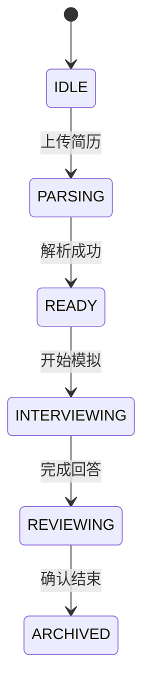
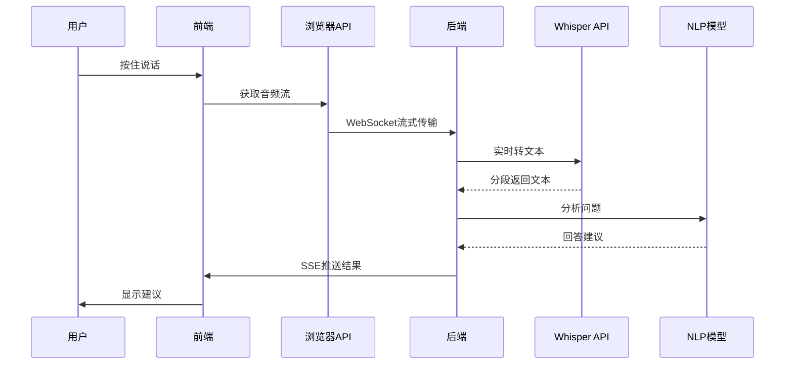
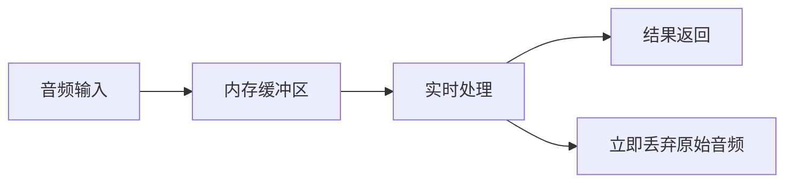

# InterviewGenius AI 应用工作流程文档

## 1. 应用流程概述

### 1.1 流程总览
InterviewGenius AI 采用前后端分离架构，主要工作流程分为：
1. 简历解析流程
2. 面试问题生成流程
3. 模拟面试流程
4. 实时面试辅助流程
5. 反馈分析流程

### 1.2 角色与流程
- **求职者**：参与全流程（上传简历→模拟面试→获取反馈）
- **应届生**：侧重模拟面试训练
- **HR/培训师**：使用企业题库管理功能

## 2. 核心业务流程

### 2.1 用户注册/登录流程


### 2.2 PDF简历解析流程


### 2.3 智能问题生成流程


### 2.4 AI模拟面试流程


### 2.5 实时面试辅助流程


## 3. 状态管理

### 3.1 面试会话状态


### 3.2 数据同步机制
- 短轮询：每30秒同步面试进度
- WebSocket：用于实时语音转文字流
- 乐观更新：用户操作立即本地响应

## 4. 错误处理流程

### 4.1 简历解析失败处理
```mermaid
flowchart TD
    A[解析错误] --> B{错误类型}
    B -->|格式错误| C[提示重新上传]
    B -->|内容模糊| D[请求手动补充]
    B -->|服务超时| E[自动重试(2次)]
```

### 4.2 实时辅助中断处理
1. 检测网络断开 → 启用本地缓存模式
2. 语音识别失败 → 切换文字输入模式
3. API限流 → 降级使用预设题库

## 5. 关键接口流程

### 5.1 语音交互时序


## 6. 安全流程

### 6.1 数据加密流程
1. 前端：敏感字段AES加密
2. 传输：HTTPS + JWT签名
3. 存储：数据库字段级加密

### 6.2 语音数据处理


## 7. 性能优化流程

### 7.1 热点数据缓存
- 问题题库：Redis缓存(未配置则内存缓存)
- 简历解析结果：本地Storage存储
- 用户偏好：IndexedDB存储

### 7.2 懒加载策略
1. 首屏只加载核心功能JS
2. 按需加载：
   - PDF解析worker
   - 语音识别模块
   - 可视化图表库

---

该文档严格遵循技术选型要求，所有流程设计均基于：
- 前端：React+Vite+TypeScript
- 后端：Flask+MySQL
- 通信：RESTful API+WebSocket
- 安全：JWT+HTTPS